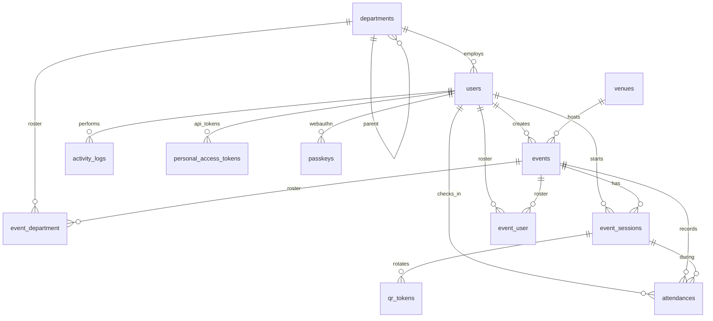

# Clockwork — Database Tables

Reference for the Laravel application database schema. All **domain** tables use **ULID** primary keys (`CHAR(26)`). Enum values are stored as strings and cast to PHP enums in `app/Enums/`.

**Inspect live schema:** `php artisan schema:dump` or `database/migrations/`.

---

## Conventions

| Rule | Detail |
|------|--------|
| Primary keys | `ulid('id')` on domain models |
| Foreign keys | `foreignUlid()` referencing parent ULIDs |
| Polymorphic | `nullableUlidMorphs()` on `activity_logs` (`subject_type`, `subject_id`) |
| Soft deletes | Not used on domain tables |
| Timestamps | `created_at`, `updated_at` on all domain tables unless noted |

---

## Entity relationship overview

---

## Core domain tables

### `users`

**Purpose:** Single table for **admin** and **employee** accounts. Employees use the mobile API (Sanctum); admins use the web dashboard (Fortify session).

| Column | Purpose |
|--------|---------|
| `first_name`, `middle_name`, `last_name`, `suffix` | Structured legal/display name |
| `email` | Login identifier (unique) |
| `password` | Hashed; used by web and API login |
| `role` | `UserRole`: `super_admin`, `event_manager`, `viewer`, `employee` |
| `employee_number` | Staff ID for employees (unique; null for admins) |
| `department_id` | FK → `departments` (employees) |
| `is_active` | Inactive users cannot check in or use mobile API |
| `two_factor_*` | Fortify 2FA for admin accounts |
| `remember_token` | Web “remember me” |

**Related:** `sessions` (web), `personal_access_tokens` (mobile), `passkeys` (admin WebAuthn), `password_reset_tokens`.

---

### `departments`

**Purpose:** Organizational units (offices/divisions) for grouping employees and filtering live ops / reports.

| Column | Purpose |
|--------|---------|
| `parent_id` | Optional hierarchy (self-FK) |
| `name` | Display name (used in CSV import matching) |
| `code` | Optional short code (unique) |
| `is_active` | Inactive departments hidden from pickers |

---

### `venues`

**Purpose:** Physical event locations and **geofence** configuration for GPS check-in validation.

| Column | Purpose |
|--------|---------|
| `latitude`, `longitude` | Map center / marker (admin Leaflet editor) |
| `geofence_radius_meters` | Circle geofence (optional) |
| `geofence_polygon` | JSON array of `{lat, lng}` vertices (optional) |
| `accuracy_buffer_meters` | Extra tolerance for GPS inaccuracy (default 50) |

Server-side `GeofenceValidator` uses radius or polygon; at least one geofence type should be set for meaningful check-ins.

---

### `events`

**Purpose:** A scheduled gathering that requires attendance (convocation, training, etc.).

| Column | Purpose |
|--------|---------|
| `venue_id` | FK → `venues` |
| `created_by` | FK → `users` (coordinator who created the event) |
| `type` | `EventType` (e.g. convocation, training, meeting) |
| `status` | `EventStatus`: `draft`, `scheduled`, `live`, `closed`, `cancelled` |
| `starts_at`, `ends_at` | Event schedule window |
| `check_in_opens_at`, `check_in_closes_at` | When mobile check-in is allowed |
| `qr_rotation_seconds` | How often the venue QR payload rotates (15–300) |
| `duplicate_policy` | `DuplicatePolicy`: `per_event` or `per_calendar_day` |
| `roster_scope` | `EventRosterScope`: who counts as “expected” on live/reports |
| `display_secret` | Unguessable token for public QR display URL |
| `display_pin_hash` | Optional bcrypt PIN for kiosk display unlock |

**Indexes:** `(status, starts_at)` for listings and dashboard.

---

### `event_department` (pivot)

**Purpose:** When `events.roster_scope = departments`, links an event to departments whose **active employees** are expected to attend.

| Column | Purpose |
|--------|---------|
| `event_id`, `department_id` | Composite primary key |

---

### `event_user` (pivot)

**Purpose:** When `events.roster_scope = employees`, links an event to specific employees expected to attend.

| Column | Purpose |
|--------|---------|
| `event_id`, `user_id` | Composite primary key |

---

### `event_sessions`

**Purpose:** A **live check-in period** for an event. QR codes are only valid while a session is `active`.

| Column | Purpose |
|--------|---------|
| `event_id` | FK → `events` |
| `started_by` | FK → `users` (admin who started the session) |
| `status` | `EventSessionStatus`: `active`, `paused`, `ended` |
| `started_at`, `ended_at` | Session window |

Starting a session typically sets the event to `live`; ending sets `closed`.

**Indexes:** `(event_id, status)`, `(event_id, status, started_at)` for live ops queries.

---

### `qr_tokens`

**Purpose:** **Rotating check-in secrets**. Only a **SHA-256 hash** is stored; the plain token is shown in the venue QR and sent by the Flutter app.

| Column | Purpose |
|--------|---------|
| `event_session_id` | FK → `event_sessions` |
| `token_hash` | `hash('sha256', plain_token)` (unique) |
| `issued_at`, `expires_at` | Validity window (drives rotation) |

Plain tokens are also cached in Redis/file cache (`QrTokenService`) until expiry. Scheduler runs `clockwork:rotate-qr-tokens` every 10 seconds.

**Indexes:** `(event_session_id, expires_at)` for rotation lookups.

---

### `attendances`

**Purpose:** Immutable record that an employee was present at an event (mobile check-in or admin manual entry).

| Column | Purpose |
|--------|---------|
| `event_id`, `user_id` | **Unique together** — one row per employee per event (unless `per_calendar_day` policy applies at service layer) |
| `event_session_id` | Session active at check-in time (nullable if session ended) |
| `checked_in_at` | Server timestamp of record |
| `latitude`, `longitude`, `accuracy_meters`, `gps_captured_at` | GPS snapshot from mobile |
| `source` | `AttendanceSource`: `mobile`, `manual` |
| `status` | `AttendanceStatus`: `present`, `late`, `manual_override`, etc. |
| `idempotency_key` | Optional unique key for safe API retries |
| `manual_override_by`, `manual_override_reason` | Admin override audit fields |
| `validation_metadata` | Optional JSON (future diagnostics) |

**Indexes:** `(event_id, checked_in_at)`, `(user_id, checked_in_at)` for reports and history.

---

### `activity_logs`

**Purpose:** **Audit trail** for sensitive admin actions (manual attendance, imports, password changes, roster updates).

| Column | Purpose |
|--------|---------|
| `user_id` | Admin who performed the action (nullable) |
| `subject_type`, `subject_id` | Polymorphic link (e.g. `Attendance`) |
| `action` | Machine key, e.g. `manual_attendance`, `employee_import` |
| `properties` | JSON context (event id, reason, counts, etc.) |
| `ip_address`, `user_agent` | Request metadata |

**Indexes:** `created_at` for chronological listing.

---

## Authentication & API tables

### `sessions`

**Purpose:** Laravel **web session** storage for admin dashboard (cookie-based).

| Column | Purpose |
|--------|---------|
| `id` | Session ID |
| `user_id` | FK → `users` (nullable for guest) |
| `payload` | Serialized session data |
| `last_activity` | Expiry / garbage collection |

---

### `password_reset_tokens`

**Purpose:** Password reset flow for **employees** (API) and **admins** (Fortify). Keyed by email.

| Column | Purpose |
|--------|---------|
| `email` | Primary key |
| `token` | Hashed reset token |
| `created_at` | Expiry enforcement |

---

### `personal_access_tokens`

**Purpose:** **Laravel Sanctum** bearer tokens for the Flutter app (`/api/v1/*`).

| Column | Purpose |
|--------|---------|
| `tokenable_type`, `tokenable_id` | Morph to `User` (ULID) |
| `name` | Device label from login (`device_name`) |
| `token` | Hashed token (client receives `id\|plainText`) |
| `last_used_at`, `expires_at` | Optional token lifecycle |

Login revokes all prior tokens (one active session per employee device).

---

### `passkeys`

**Purpose:** **WebAuthn passkeys** for admin Fortify login (passwordless).

| Column | Purpose |
|--------|---------|
| `user_id` | FK → `users` |
| `credential_id`, `credential` | WebAuthn credential payload (JSON) |
| `last_used_at` | Last authentication |

---

## Framework / infrastructure tables

These ship with Laravel and support caching, queues, and future background work.

| Table | Purpose |
|-------|---------|
| `cache` | Database cache driver entries (also used for QR token cache if `CACHE_STORE=database`) |
| `cache_locks` | Atomic cache locks |
| `jobs` | Queue jobs (exports, notifications when enabled) |
| `job_batches` | Batched queue jobs |
| `failed_jobs` | Dead-letter queue for debugging |

---

## Enum reference (stored values)

| Enum | Column(s) | Values (summary) |
|------|-----------|------------------|
| `UserRole` | `users.role` | `super_admin`, `event_manager`, `viewer`, `employee` |
| `EventType` | `events.type` | `convocation`, `training`, `assembly`, `meeting`, … |
| `EventStatus` | `events.status` | `draft`, `scheduled`, `live`, `closed`, `cancelled` |
| `EventSessionStatus` | `event_sessions.status` | `active`, `paused`, `ended` |
| `EventRosterScope` | `events.roster_scope` | `all_active`, `departments`, `employees` |
| `DuplicatePolicy` | `events.duplicate_policy` | `per_event`, `per_calendar_day` |
| `AttendanceSource` | `attendances.source` | `mobile`, `manual` |
| `AttendanceStatus` | `attendances.status` | `present`, `late`, `manual_override`, … |

See `app/Enums/*.php` for authoritative labels and any added cases.

---

## Data flow (check-in)

1. Admin starts **`event_sessions`** → event goes **live**.
2. **`qr_tokens`** rotate on a schedule; display page reads current plain token from cache.
3. Employee scans QR → mobile API validates token hash, geofence, roster policy, duplicates.
4. Row inserted into **`attendances`**; optional row in **`activity_logs`** if manual.

---

## Seeding

Local sample data: `php artisan db:seed` (`ClockworkSeeder`).

| Account | Role |
|---------|------|
| `admin@clockwork.test` | Super Admin |
| `coordinator@clockwork.test` | Event Manager |
| `employee@clockwork.test` | Employee (`EMP-00001`) |

Default password: `password`.

---

*Last updated: 2026-06-04 — aligns with migrations in `database/migrations/`.*
