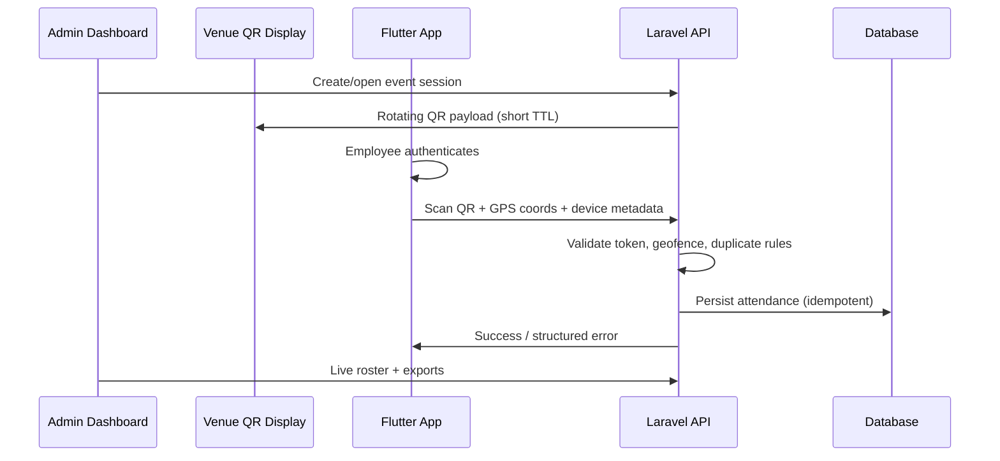
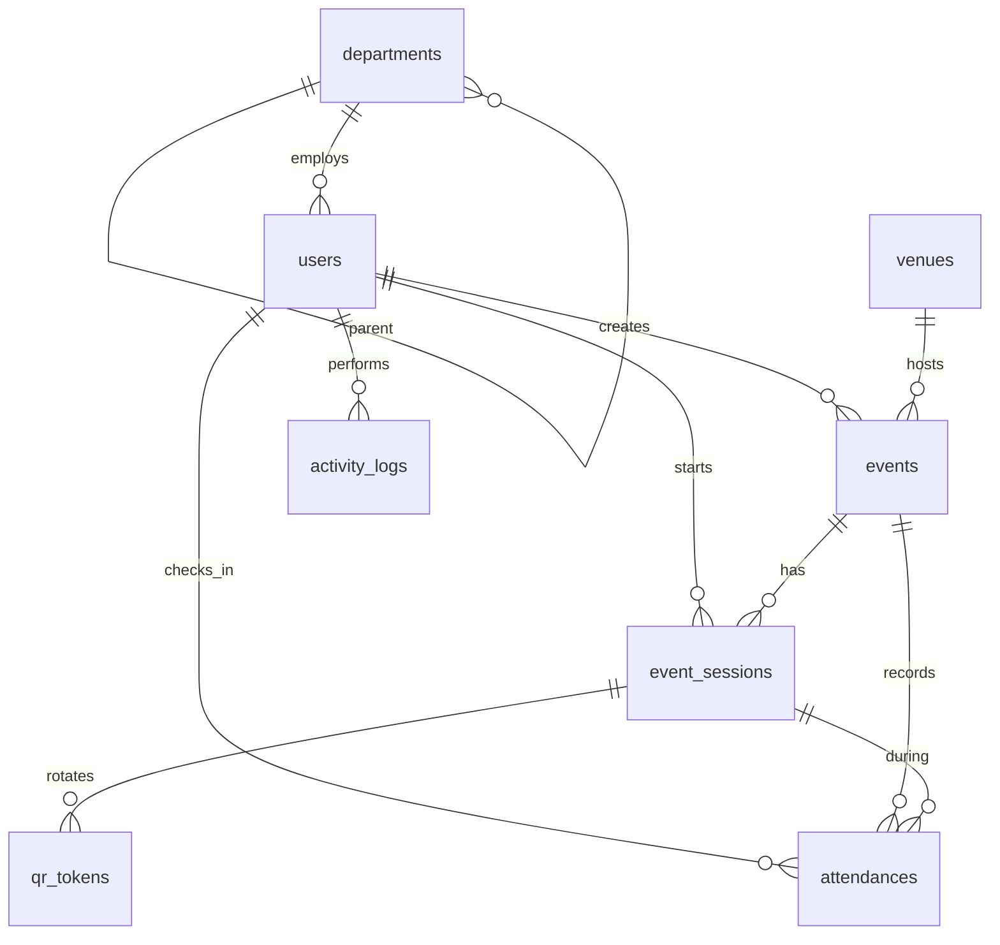

# Clockwork — Project Context

> Internal reference for AI assistants and developers working on the Provincial Government of Davao del Sur employee attendance system.

## Overview

**Clockwork** replaces slow biometric queueing during large government events (e.g. Monday convocations) with fast, server-validated mobile check-ins. Employees scan a **dynamic, time-rotating QR code** displayed at the venue; the backend validates **GPS location** and **geofence** rules before recording attendance.

| Layer | Technology | Role |
|-------|------------|------|
| Backend + Admin | Laravel 13, Inertia v3, Vue 3, Fortify | API, validation, admin dashboard, QR display |
| Maps & geofencing (admin) | **Leaflet.js** + **OpenStreetMap** tiles | Venue placement, geofence editor (circle/polygon), map preview |
| Mobile (separate repo) | Flutter | Employee check-in; device GPS for check-in validation |
| Infra | Queues, caching, DB | High concurrency, audit trail |

## Mobile deployment model (Flutter)

**One employee, one device** — each government-issued or assigned phone is used by a single employee only. There is no shared kiosk or “switch user” flow on mobile.

| Implication | Approach |
|-------------|----------|
| Auth UX | Login once per device; persist Sanctum token in secure storage; optional `device_name` on login for support/audit (e.g. asset tag), not multi-account switching |
| API design | Rate limits and check-in idempotency are keyed per **user**, which matches thousands of devices checking in concurrently |
| Out of scope (mobile) | Shared-tablet check-in, QR scan on behalf of another employee, admin roles on the Flutter app |
| Security | Lost/stolen device = compromise of that employee’s token only; HR/IT can deactivate the user or revoke tokens from admin (token revocation UI optional later) |
| Venue display | Remains a separate **kiosk/browser** URL (`/display/{secret}`), not the Flutter app |

The Laravel API does not enforce hardware binding in v1; trust is “this bearer token belongs to this employee.” Stricter device registration can be added later if IT requires it.

## Organization & Users

- **Client:** Provincial Government of Davao del Sur (PG-DDS).
- **End users (mobile):** Provincial employees checking in at events.
- **Admin users (web):** HR / event coordinators / IT managing events, venues, employees, and attendance reports.
- **Scale:** Thousands of concurrent check-ins during peak events (convocations).

## Problem Statement

Biometric devices create long queues and bottlenecks when thousands of employees arrive in a short window. The system must:

1. Allow **sub-second check-in** per employee after scan.
2. Prove **physical presence** at the event (not remote spoofing).
3. Prevent **duplicate** and **fraudulent** submissions.
4. Provide **auditable** attendance records for HR/compliance.

## Core Check-In Flow (End-to-End)

### Validation Rules (Server-Side — Non-Negotiable)

All trust decisions happen on the server. The mobile app is untrusted input.

| Check | Purpose |
|-------|---------|
| Authenticated employee | Only registered users may check in |
| QR token valid + not expired | Time-rotating code prevents replay/screenshots |
| Event/session active | Check-in only during configured window |
| Geofence (lat/lng vs venue polygon/radius) | Physical presence |
| Optional accuracy / mock-location signals | Reduce GPS spoofing (policy-dependent) |
| One attendance per employee per event (or per day) | Duplicate prevention |
| Rate limiting / idempotency keys | Abuse protection under load |

## Dynamic QR Code

- Short-lived tokens bound to **event** (and optionally **session/check-in window**).
- Rotation interval configurable (e.g. 30–60 seconds).
- Display mode: full-screen page on projector/TV at venue (admin “presentation” view).
- Tokens must be **unpredictable** (signed or stored server-side with expiry).

## Geolocation & Geofence

### Map stack (decided)

All **admin** location and geofence UI uses **[Leaflet.js](https://leafletjs.com/)** with **[OpenStreetMap](https://www.openstreetmap.org/)** raster tiles (no Google Maps dependency).

| Use case | Where | Notes |
|----------|--------|--------|
| Pick venue coordinates | Venue create/edit | Click or drag marker; sync `latitude` / `longitude` |
| Geofence editor | Venue create/edit | Circle radius and/or polygon vertices on the map |
| Map preview | Venue detail / list | Read-only bounds + geofence overlay |
| Live event context | Optional later | Show venue geofence during session ops |

**Conventions for implementation:**

- Vue: wrap Leaflet in a dedicated component (e.g. `VenueMapPicker.vue`, `GeofenceEditor.vue`); load Leaflet CSS once (app or component scope).
- Default map center: Davao del Sur / Digos City region (~6.75°N, 125.35°E) unless venue coords exist.
- Persist geofence as today: `geofence_radius_meters` and/or `geofence_polygon` JSON on `venues`; Leaflet is presentation/editing only.
- **Server remains authoritative** for check-in validation (Haversine / point-in-polygon in PHP); map does not replace backend geofence logic.
- Attribute OSM/Leaflet per their licenses in app footer or about page when maps ship.

Flutter mobile app uses platform GPS APIs for check-in coordinates; it does **not** need Leaflet unless a native map preview is added later.

### Validation (unchanged)

- Venues define **geofence** (circle radius and/or polygon).
- Mobile sends latitude, longitude, accuracy (meters), and timestamp.
- Server evaluates point-in-polygon or distance-from-center; reject if outside tolerance.
- Configurable **buffer** (`accuracy_buffer_meters`) for GPS inaccuracy at large venues.

## Security & Compliance

- Employee auth: API tokens (Sanctum/Passport) or similar for Flutter; Fortify/session for admin web.
- Admin RBAC: roles (e.g. super admin, event manager, viewer).
- Audit log: who changed events, manual overrides, exports.
- HTTPS only; no sensitive data in QR beyond opaque token.
- PII protection for employee records; retention policy TBD with client.

## Technical Stack (This Repository)

- **PHP 8.4**, **Laravel 13**
- **Inertia.js v3** + **Vue 3** + **Tailwind CSS v4**
- **Laravel Fortify** — login, 2FA, passkeys (admin)
- **Laravel Wayfinder** — typed frontend routes
- **PHPUnit** for tests
- **Leaflet.js** + **OpenStreetMap** — venue maps and geofence editing (to be added to `package.json` when map UI is built)
- **Queues** — recommended for post-check-in jobs (notifications, exports)
- **Redis** — recommended for QR token cache and rate limiting at scale

## Current Codebase State

Laravel Vue starter kit plus Clockwork domain schema:

- Fortify auth, profile, security settings (admin)
- **ULID primary keys** on all domain tables (`HasUlids` trait)
- Models: `Department`, `Venue`, `Event`, `EventSession`, `QrToken`, `Attendance`, `ActivityLog`
- Enums in `app/Enums/`
- `ClockworkSeeder` with sample admin, coordinator, employee, venue, event
- Feature tests: `tests/Feature/Domain/ClockworkSchemaTest.php`

**After pulling schema changes:** run `php artisan migrate:fresh --seed` (destructive; dev only).

## Database Conventions

- **Primary keys:** `CHAR(26)` ULIDs via `$table->ulid('id')->primary()` and `HasUlids` on models.
- **Foreign keys:** `foreignUlid()` referencing parent ULIDs.
- **Polymorphic:** `nullableUlidMorphs()` on `activity_logs`.
- **String-backed enums** stored in `VARCHAR` columns, cast to PHP enums on models.

## Schema Overview

| Table | Purpose |
|-------|---------|
| `users` | Admins and employees (role enum); `employee_number` for staff |
| `departments` | Org units; optional `parent_id` hierarchy |
| `venues` | Locations with circle and/or polygon geofence |
| `events` | Scheduled gatherings; `display_secret` for QR display URL |
| `event_sessions` | Live check-in window (active / paused / ended) |
| `qr_tokens` | Hashed rotating tokens (`token_hash`, `expires_at`) |
| `attendances` | Check-in records; unique `(event_id, user_id)` |
| `activity_logs` | Audit trail (polymorphic `subject`) |

### Resolved Schema Decisions

| Decision | Choice |
|----------|--------|
| User storage | Single `users` table with `UserRole` enum |
| Employee ID | `employee_number` (nullable for admins) |
| Duplicate check-in | Unique per `event_id` + `user_id` (`DuplicatePolicy` on event for future day-level rules) |
| Geofence | `geofence_radius_meters` and/or `geofence_polygon` JSON on `venues` |
| Map / geofence UI | Leaflet.js + OpenStreetMap (admin Vue only) |
| QR display URL | Unguessable `display_secret` on `events` |

### Seed Accounts (local)

| Email | Role | Password |
|-------|------|----------|
| `admin@clockwork.test` | Super Admin | `password` |
| `coordinator@clockwork.test` | Event Manager | `password` |
| `employee@clockwork.test` | Employee (`EMP-00001`) | `password` |

## Laravel Web App — Module Map

Modules below are **in scope for this repository**. Flutter is out of scope here but consumes the **Mobile API** module.

### 1. Authentication & Authorization (Admin)

- Fortify login for dashboard users
- Roles & permissions (policies/gates)
- Optional: separate `employees` vs `admin_users` tables, or unified `users` with role enum
- Session management, 2FA for privileged accounts

### 2. Organization & Employee Master Data

- Departments / offices / divisions (hierarchical optional)
- Employee profiles: employee ID, name, email, status (active/inactive)
- Bulk import (CSV) for HR onboarding — **implemented** at `/users/import`
- Link employee to user account for mobile login

### 3. Venues & Geofences — **map editor implemented**

- Venue CRUD with **Leaflet + OpenStreetMap** on create/edit (radius or polygon geofence)
- Default GPS accuracy buffer per venue

### 4. Events & Schedules

- Event types (convocation, training, assembly, etc.)
- Event lifecycle: draft → scheduled → live → closed
- Date/time windows, venue association
- Recurring events (e.g. weekly Monday convocation) — optional
- Check-in window (open/close times) distinct from event display time if needed

### 5. Event Sessions & QR Token Service — **implemented**

- Admin: start / pause / resume / end session; manual “rotate QR now”
- `QrTokenService` issues hashed tokens; plain token cached until expiry
- `clockwork:rotate-qr-tokens` scheduled every 10s (run scheduler in production)
- Event status → `live` on session start, `closed` when session ends

### 6. Venue QR Display (Presentation UI) — **implemented**

- `GET /display/{display_secret}` — kiosk page (QR + countdown, polls for token)
- `GET /display/{display_secret}/token` — JSON for current QR payload
- Link copied from event **Live operations** page

### 7. Attendance Engine (Core Domain)

- `attendances` records: employee, event, timestamp, GPS snapshot, validation result
- Idempotent check-in endpoint (mobile API) — **implemented**
- Duplicate detection rules per event policy
- Manual check-in / override by admin with reason (audit) — **implemented** (`events/{event}/attendances`)
- Late check-in status (`present` vs `late`) via `AttendanceStatusResolver` and `CLOCKWORK_LATE_GRACE_MINUTES` (default 15)

### 8. Mobile API (Backend for Flutter) — **implemented (Sanctum v1)**

REST JSON API at `/api/v1` (Bearer token; employees only):

| Method | Path | Purpose |
|--------|------|---------|
| `POST` | `/api/v1/auth/login` | Email/password → Sanctum token |
| `POST` | `/api/v1/auth/logout` | Revoke current token |
| `GET` | `/api/v1/profile` | Current employee |
| `GET` | `/api/v1/events` | Check-in-eligible live events (active session + window) |
| `POST` | `/api/v1/check-in` | QR + GPS validation → attendance |
| `GET` | `/api/v1/attendances` | Paginated attendance history |

- **Auth:** Laravel Sanctum personal access tokens (`HasApiTokens` on `User`; `personal_access_tokens` uses `ulidMorphs` for ULID users).
- **Services:** `CheckInService`, `GeofenceValidator` (Haversine radius + polygon).
- **Error codes:** `CheckInErrorCode` enum (`QR_EXPIRED`, `OUTSIDE_GEOFENCE`, `ALREADY_CHECKED_IN`, `EVENT_NOT_ACTIVE`, `UNAUTHORIZED`, `INVALID_QR`, `ACCOUNT_INACTIVE`).
- **Rate limiting:** login 10/min, check-in 30/min, other routes 120/min (per user/IP)
- **API docs:** `docs/API.md`
- **Database tables:** `docs/DATABASE.md`
- **Password reset:** `POST /api/v1/auth/forgot-password`, `POST /api/v1/auth/reset-password` (email deep link via `CLOCKWORK_MOBILE_PASSWORD_RESET_URL`).
- **One active token:** login revokes all prior Sanctum tokens; admin can revoke from user edit screen.
- **HR bulk import:** CSV at `/users/import` — one department per upload; columns `email`, `first_name`, `middle_name`, `last_name`, `suffix`, `id_number` (initial password); auto `employee_number` (e.g. `HR-00001` from department `code`).
- **Scale:** composite indexes on `users` and `event_sessions`; venue geofence cache during check-in (`CLOCKWORK_VENUE_GEOFENCE_CACHE_SECONDS`).

### 9. Real-Time & Live Operations Dashboard — **implemented**

- `GET /events/{event}/live` — session controls, stats, recent check-ins (5s poll), missing employees roster with department filter
- Display PIN management on live page
- Per-event expected roster (`roster_scope`: all active, selected departments, or selected employees) at `/events/{event}/roster`
- Operations dashboard at `/dashboard` (live events, check-ins today, recent activity)

### 10. Reports & Analytics — **implemented**

- `GET /reports` — date-range event list with attendance counts
- `GET /reports/events/{event}` — summary, department breakdown, attendance rate
- `GET /reports/export` — CSV export for filtered events

### 11. Notifications (Optional Phases)

- Email/SMS reminders before event (queue-driven)
- Admin alert on session anomalies (low check-in rate)

### 12. Audit & System Administration

- Activity log UI at `/audit-log` (manual overrides, imports, password actions, roster updates)
- System settings: QR TTL, default geofence buffer, rate limits
- Admin user management — employee password reset email + set temporary password on user edit
- Health: queue status, failed jobs (internal)

### 13. Infrastructure & Performance

- Database indexes on `event_id`, `employee_id`, `checked_in_at`
- Queue workers for heavy exports
- Horizon (optional) for queue monitoring
- Caching strategy for active event tokens and geofence config
- Load testing plan for convocation peak

## Suggested Implementation Phases

| Phase | Modules | Outcome |
|-------|---------|---------|
| **MVP** | 1, 2, 4, 5, 7, 8, 9 (basic) | Single event check-in works end-to-end with Flutter |
| **V1** | 3 (Leaflet maps), 6, 10 | Geofence map UI, projector QR, reports |
| **V2** | 11, 12, 13 hardening | Notifications, audit, scale tuning |

## Out of Scope (This Repo)

- Flutter mobile UI/UX implementation
- Biometric hardware integration
- Payroll / leave management (unless later integrated via export only)

## API Contract Notes for Flutter Team

Document and version:

- Check-in request body: `qr_token`, `latitude`, `longitude`, `accuracy`, `captured_at`, optional `idempotency_key`
- Error enum: `QR_EXPIRED`, `OUTSIDE_GEOFENCE`, `ALREADY_CHECKED_IN`, `EVENT_NOT_ACTIVE`, `UNAUTHORIZED`
- OpenAPI or Scribe-generated docs recommended

## Glossary

| Term | Meaning |
|------|---------|
| Event | A scheduled gathering requiring attendance |
| Session | Active check-in period for an event (QR live) |
| Geofence | Geographic boundary for valid check-in |
| Rotating QR | Time-limited token embedded in QR, refreshed periodically |
| Attendance | Server-validated record of employee presence |

## Open Decisions (Confirm with Stakeholders)

- [ ] `DuplicatePolicy::PerCalendarDay` enforcement logic (column exists; service not built)
- [ ] Offline check-in support (likely no for v1)
- [x] Sanctum for mobile API (Passport not used)
- [x] Optional staff PIN on QR display page (`display_pin_hash`, unlock at `/display/{secret}/unlock`)

---

*Last updated: 2026-06-02 — Leaflet/OSM noted for maps; align with stakeholder decisions as they are made.*
