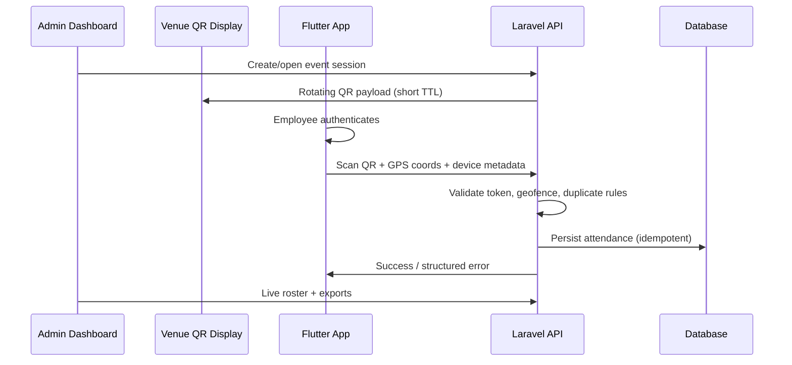
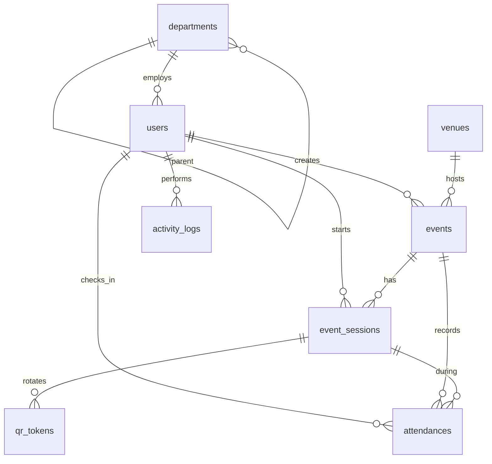

# Clockwork — Project Context

> Internal reference for AI assistants and developers working on the Provincial Government of Davao del Sur employee attendance system.

## Overview

**Clockwork** replaces slow biometric queueing during large government events (e.g. Monday convocations) with fast, server-validated mobile check-ins. Employees scan a **dynamic, time-rotating QR code** displayed at the venue; the backend validates **GPS location** and **geofence** rules before recording attendance.

| Layer | Technology | Role |
|-------|------------|------|
| Backend + Admin | Laravel 13, Inertia v3, Vue 3, Fortify | API, validation, admin dashboard, QR display |
| Mobile (separate repo) | Flutter | Employee check-in app |
| Infra | Queues, caching, DB | High concurrency, audit trail |

## Organization & Users

- **Client:** Provincial Government of Davao del Sur (PG-DDS).
- **End users (mobile):** Provincial employees checking in at events.
- **Admin users (web):** HR / event coordinators / IT managing events, venues, employees, and attendance reports.
- **Scale:** Thousands of concurrent check-ins during peak events (convocations).

## Problem Statement

Biometric devices create long queues and bottlenecks when thousands of employees arrive in a short window. The system must:

1. Allow **sub-second check-in** per employee after scan.
2. Prove **physical presence** at the event (not remote spoofing).
3. Prevent **duplicate** and **fraudulent** submissions.
4. Provide **auditable** attendance records for HR/compliance.

## Core Check-In Flow (End-to-End)

### Validation Rules (Server-Side — Non-Negotiable)

All trust decisions happen on the server. The mobile app is untrusted input.

| Check | Purpose |
|-------|---------|
| Authenticated employee | Only registered users may check in |
| QR token valid + not expired | Time-rotating code prevents replay/screenshots |
| Event/session active | Check-in only during configured window |
| Geofence (lat/lng vs venue polygon/radius) | Physical presence |
| Optional accuracy / mock-location signals | Reduce GPS spoofing (policy-dependent) |
| One attendance per employee per event (or per day) | Duplicate prevention |
| Rate limiting / idempotency keys | Abuse protection under load |

## Dynamic QR Code

- Short-lived tokens bound to **event** (and optionally **session/check-in window**).
- Rotation interval configurable (e.g. 30–60 seconds).
- Display mode: full-screen page on projector/TV at venue (admin “presentation” view).
- Tokens must be **unpredictable** (signed or stored server-side with expiry).

## Geolocation & Geofence

- Venues define **geofence** (circle radius and/or polygon).
- Mobile sends latitude, longitude, accuracy (meters), and timestamp.
- Server evaluates point-in-polygon or distance-from-center; reject if outside tolerance.
- Configurable **buffer** for GPS inaccuracy at large venues.

## Security & Compliance

- Employee auth: API tokens (Sanctum/Passport) or similar for Flutter; Fortify/session for admin web.
- Admin RBAC: roles (e.g. super admin, event manager, viewer).
- Audit log: who changed events, manual overrides, exports.
- HTTPS only; no sensitive data in QR beyond opaque token.
- PII protection for employee records; retention policy TBD with client.

## Technical Stack (This Repository)

- **PHP 8.4**, **Laravel 13**
- **Inertia.js v3** + **Vue 3** + **Tailwind CSS v4**
- **Laravel Fortify** — login, 2FA, passkeys (admin)
- **Laravel Wayfinder** — typed frontend routes
- **PHPUnit** for tests
- **Queues** — recommended for post-check-in jobs (notifications, exports)
- **Redis** — recommended for QR token cache and rate limiting at scale

## Current Codebase State

Laravel Vue starter kit plus Clockwork domain schema:

- Fortify auth, profile, security settings (admin)
- **ULID primary keys** on all domain tables (`HasUlids` trait)
- Models: `Department`, `Venue`, `Event`, `EventSession`, `QrToken`, `Attendance`, `ActivityLog`
- Enums in `app/Enums/`
- `ClockworkSeeder` with sample admin, coordinator, employee, venue, event
- Feature tests: `tests/Feature/Domain/ClockworkSchemaTest.php`

**After pulling schema changes:** run `php artisan migrate:fresh --seed` (destructive; dev only).

## Database Conventions

- **Primary keys:** `CHAR(26)` ULIDs via `$table->ulid('id')->primary()` and `HasUlids` on models.
- **Foreign keys:** `foreignUlid()` referencing parent ULIDs.
- **Polymorphic:** `nullableUlidMorphs()` on `activity_logs`.
- **String-backed enums** stored in `VARCHAR` columns, cast to PHP enums on models.

## Schema Overview

| Table | Purpose |
|-------|---------|
| `users` | Admins and employees (role enum); `employee_number` for staff |
| `departments` | Org units; optional `parent_id` hierarchy |
| `venues` | Locations with circle and/or polygon geofence |
| `events` | Scheduled gatherings; `display_secret` for QR display URL |
| `event_sessions` | Live check-in window (active / paused / ended) |
| `qr_tokens` | Hashed rotating tokens (`token_hash`, `expires_at`) |
| `attendances` | Check-in records; unique `(event_id, user_id)` |
| `activity_logs` | Audit trail (polymorphic `subject`) |

### Resolved Schema Decisions

| Decision | Choice |
|----------|--------|
| User storage | Single `users` table with `UserRole` enum |
| Employee ID | `employee_number` (nullable for admins) |
| Duplicate check-in | Unique per `event_id` + `user_id` (`DuplicatePolicy` on event for future day-level rules) |
| Geofence | `geofence_radius_meters` and/or `geofence_polygon` JSON on `venues` |
| QR display URL | Unguessable `display_secret` on `events` |

### Seed Accounts (local)

| Email | Role | Password |
|-------|------|----------|
| `admin@clockwork.test` | Super Admin | `password` |
| `coordinator@clockwork.test` | Event Manager | `password` |
| `employee@clockwork.test` | Employee (`EMP-00001`) | `password` |

## Laravel Web App — Module Map

Modules below are **in scope for this repository**. Flutter is out of scope here but consumes the **Mobile API** module.

### 1. Authentication & Authorization (Admin)

- Fortify login for dashboard users
- Roles & permissions (policies/gates)
- Optional: separate `employees` vs `admin_users` tables, or unified `users` with role enum
- Session management, 2FA for privileged accounts

### 2. Organization & Employee Master Data

- Departments / offices / divisions (hierarchical optional)
- Employee profiles: employee ID, name, email, status (active/inactive)
- Bulk import (CSV/Excel) for HR onboarding
- Link employee to user account for mobile login

### 3. Venues & Geofences

- Venue CRUD: name, address, coordinates
- Geofence editor: radius and/or polygon vertices
- Default accuracy tolerance per venue
- Map preview in admin (optional phase 2)

### 4. Events & Schedules

- Event types (convocation, training, assembly, etc.)
- Event lifecycle: draft → scheduled → live → closed
- Date/time windows, venue association
- Recurring events (e.g. weekly Monday convocation) — optional
- Check-in window (open/close times) distinct from event display time if needed

### 5. Event Sessions & QR Token Service

- **Live session** per event (start/stop from admin)
- Token generation, rotation, invalidation on session end
- Cached token store (Redis) with TTL
- Signed payload or opaque ID → server lookup

### 6. Venue QR Display (Presentation UI)

- Public or semi-public route: large QR + countdown to next rotation
- Event name, clock, optional branding (PG-DDS)
- Kiosk-friendly; no admin chrome; optional PIN to open display URL

### 7. Attendance Engine (Core Domain)

- `attendances` records: employee, event, timestamp, GPS snapshot, validation result
- Idempotent check-in endpoint (mobile API)
- Duplicate detection rules per event policy
- Manual check-in / override by admin with reason (audit)
- Late / absent flags based on window rules

### 8. Mobile API (Backend for Flutter)

REST or JSON API (versioned, e.g. `/api/v1`):

| Area | Endpoints (conceptual) |
|------|------------------------|
| Auth | Login, logout, refresh, password reset |
| Profile | Current employee, device registration |
| Events | Today’s check-in-eligible events |
| Check-in | Submit scan + GPS; receive success/error codes |
| History | Employee’s own attendance history |

- Sanctum personal access tokens or OAuth2 (decide early)
- Standard error codes for geofence fail, expired QR, duplicate, etc.
- Rate limiting per user/IP

### 9. Real-Time & Live Operations Dashboard

- Live check-in counter during active session
- Recent check-ins feed (paginated / websocket optional)
- Missing employees list vs expected roster
- Session controls: start, pause, end, rotate QR now

### 10. Reports & Analytics

- Per-event attendance summary
- Per-department breakdown
- Export CSV/PDF
- Date range filters, attendance rate trends
- Optional: integration export format for HR systems

### 11. Notifications (Optional Phases)

- Email/SMS reminders before event (queue-driven)
- Admin alert on session anomalies (low check-in rate)

### 12. Audit & System Administration

- Activity log (model changes, manual overrides)
- System settings: QR TTL, default geofence buffer, rate limits
- Admin user management
- Health: queue status, failed jobs (internal)

### 13. Infrastructure & Performance

- Database indexes on `event_id`, `employee_id`, `checked_in_at`
- Queue workers for heavy exports
- Horizon (optional) for queue monitoring
- Caching strategy for active event tokens and geofence config
- Load testing plan for convocation peak

## Suggested Implementation Phases

| Phase | Modules | Outcome |
|-------|---------|---------|
| **MVP** | 1, 2, 4, 5, 7, 8, 9 (basic) | Single event check-in works end-to-end with Flutter |
| **V1** | 3, 6, 10 | Full venue/geofence, projector QR, reports |
| **V2** | 11, 12, 13 hardening | Notifications, audit, scale tuning |

## Out of Scope (This Repo)

- Flutter mobile UI/UX implementation
- Biometric hardware integration
- Payroll / leave management (unless later integrated via export only)

## API Contract Notes for Flutter Team

Document and version:

- Check-in request body: `qr_token`, `latitude`, `longitude`, `accuracy`, `captured_at`, optional `idempotency_key`
- Error enum: `QR_EXPIRED`, `OUTSIDE_GEOFENCE`, `ALREADY_CHECKED_IN`, `EVENT_NOT_ACTIVE`, `UNAUTHORIZED`
- OpenAPI or Scribe-generated docs recommended

## Glossary

| Term | Meaning |
|------|---------|
| Event | A scheduled gathering requiring attendance |
| Session | Active check-in period for an event (QR live) |
| Geofence | Geographic boundary for valid check-in |
| Rotating QR | Time-limited token embedded in QR, refreshed periodically |
| Attendance | Server-validated record of employee presence |

## Open Decisions (Confirm with Stakeholders)

- [ ] `DuplicatePolicy::PerCalendarDay` enforcement logic (column exists; service not built)
- [ ] Offline check-in support (likely no for v1)
- [ ] Sanctum vs Passport for mobile API
- [ ] Optional staff PIN on QR display page (in addition to `display_secret`)

---

*Last updated: 2026-06-02 — align with stakeholder decisions as they are made.*
